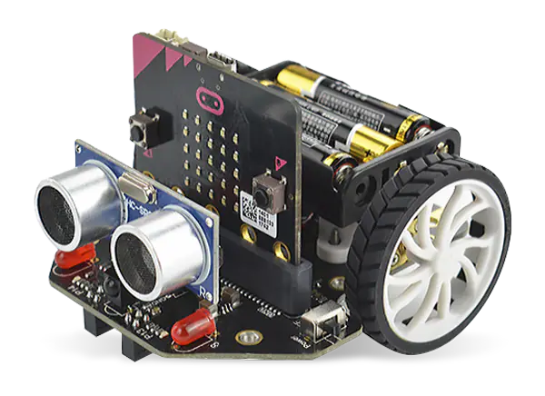
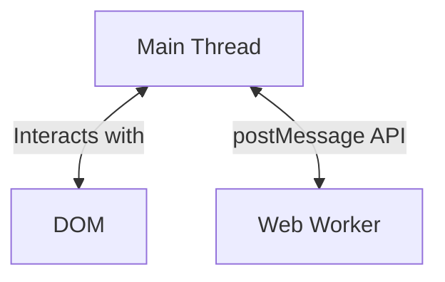

---
# try also 'default' to start simple
theme: dracula
# random image from a curated Unsplash collection by Anthony
# like them? see https://unsplash.com/collections/94734566/slidev
background: https://source.unsplash.com/collection/94734566/1920x1080
# apply any windi css classes to the current slide
class: 'text-center'
# https://sli.dev/custom/highlighters.html
highlighter: shiki
# show line numbers in code blocks
lineNumbers: false
# persist drawings in exports and build
drawings:
  persist: false
# use UnoCSS (experimental)
wakeLock: "build"
# aspect ratio for the slides
aspectRatio: 16/9
css: unocss
---

# WebTigerPython

## Unleashing Python's Full Potential in the Browser

Clemens Bachmann

---

# Who am I

Software Developer
- Departement of algorithms and **didactics**
Computer Science Teacher

---

# TigerJython 2012 (A bit of History)

|               |  |  |
|--------|------|-----|
|| | |
|Jython (Python in the JVM)| Educational Java Libraries   e.g. Turtle, GameGrid | Robotics

- Works on any Plattform (Windows, Mac, Linux)
- Easy installation
- Interactive Debugger

---

# TigerJython in 2020

- Python 2.7
- New Plattforms (iPad / Android)
- No support for popular Python libraries (numpy, scipy, matplotlib, pandas)

---

# The Case for Web Apps

- Works really on all Plattforms (Windows, Mac, Linux, Android, iPad)
- No installation needed
- Bluetooth, WebUSB etc. can also be used in the Browser
- WebAssembly makes it possible to run other Languages than JS

---

# Robotics

- WebUSB
- IoT 🛠️
- Simulation 🛠️

---
layout: iframe-2-cols
url: https://webtigerpython.ethz.ch/?code=NobwRAdghgtgpmAXGGUCWEB0AHAnmAGjABMoAXKJMAMwCcB7GAAhjQGMGAjNMptGbPVq8AVEwA6EOoxacu9Xv0HCmIyZOnMYc-pwV8BQ0ZIDEm2fLIB9bABsArgGcDy4xEmO4ZAMrY4cYgAKAGYABgBKSVo4P3JESSZEpgA3ACUmAF4-WlS0AHMACzJMaKhiK2J8nihbQMiIJJSAGUzsprhqYtLyyrzq2vCkhKS0ambMrNCmKAhiFPSMyfiGxqTqIQB3KFogwYkVxLhbUfHFpgBGadn5iaZQ5dWk2nyiusfhw-Ox5JazqZm5mlbucHo8mLYOmQ3vtGsQjlBcIFzqEImAAL4AXSAA&device=micro%3Abit
---

# Robotics - WebUSB

- Single Devices have to be added for WebUSB
- On Linux this has to be "activated"
- Only in Chrome
- Safari / Firefox declined to implement the feature
  - Many schools work with iPads
  - no real chrome

---
layout: iframe-2-cols
url: https://test.webtigerpython.ethz.ch/?code=NobwRAdghgtgpmAXGGUCWEB0AHAnmAGjABMoAXKJMAMwCcB7GAAhjQGMGAjNMptGbPVq8AVEwA6EOoxacu9Xv0HCmIyZOnMYc-pwV8BQ0ZIDEm2fLIB9bABsArgGcDy4xEmO4ZAMrY4cYgAKAGYABgBKSVo4P3JESSZEpgA3ACUmAF4-WlS0AHMACzJMaKhiK2J8nihbQMiIJJSAGUzsprhqYtLyyrzq2vCkhKS0ambMrNCmKAhiFPSMyfiGxqTqIQB3KFogwYkVxLhbUfHFpgBGadn5iaZQ5dWk2nyiusfhw-Ox5JazqZm5mlbucHo8mLYOmQ3vtGsQjlBcIFzqEImAAL4AXSAA&device=micro%3Abit
---

# Robotics - Simulation 🛠️

- Works on any device
- No robot needed
- Not real robotics

---

# Robotics - IoT 🛠️

---

# Robotics Summary

- WebUSB (Chrome only)
- WebBluetooth (Chrome only)
- No real Chrome on iPads 
  - Chrome on iPad is WebKit based

- IoT (Code runs in Browser) 🛠️
- Simulation works on anything 🛠️

---

# Visual Computing

- Turtle
  - The opposite of a blackbox
  - Intuitive commands (forward, left etc.)
  - Beginner friendly
- Game Frameworks
  - Advanced
  - Popular

---

# WebTigerPython Architecture

- Python (Pyodide runs in a Webworker)
  - UI does not freeze (single Threaded)
- Graphic Rendering can be done with callbacks

---

## Asynchronity

## Turtle

---
layout: iframe-2-cols
leftWidth: 20%
url: https://webtigerpython.ethz.ch/?code=NobwRAdghgtgpmAXGGUCWEB0AHAnmAGjABMoAXKJMNGbAewCcyACPAc1jgB0IeBiZgEkIaMmigAbNAC84zAAq4O8Hu06YMogBQBKHv2YBlOCwCu2ZmQAWc4mgDO2CVFw97AYwZw4EZgF5WJXU7R2dcTHsTAH0YOmI4LS0AZgAGFIJmVJSdPV4IAXkwuAZWBjpsYrE4ex4vdxYAtXhMACU4eq105i6AVl7s_Qh4gDNmVAxdRB5mGeYBAFl0Xwk6cunZgHcrNAk5ABUGUzgp31mzhboANzknF2L1s5mAazhce39A5ThMF_C2aOwXnskWIugejzQo1-9mATW-AGkogAZACiADE9gBdRDMOpkTAAD2YAFoAj1wWdIcxobCgs1ES1BABxAASWJxeMJzAA1GSKbMqTS4ZhEQBVeTY3HtfG4El806PZiC14w4WIgAiAHkAOoAOUlnNlvOY5IVjwE6oYUA2zDg1wYuGsGDY_JmHi8Pkwwx2EkSXX9OVdn2CVo2mDxWiDZ3d3ggGS0ACYej0MgGMnjcoqZsKQrdwsMpNgwWazsKxM0AMIrdxPXSYMQ1rQANgGEHGEGLYAAvpigAß
---

¬
---

---

# Debugger

---

# Future of WebTigerPython

- 🐛 **Debugger** - Memory Visualisation
- 📜 **Documentation** - Searchable, Integrated, Interactive
- 🤖 **Robotics Update** - Minification, Calibration
- 🤹 **Pygame** - Ground Work for GameGrid
- 💻 **Robotics Simulation** - built-in recording and camera view
- 🎵 **Jython Music** - export into PDF, PNGs, or even a hostable SPA
- 🗃️ **Databases** - anything possible on a webpage
