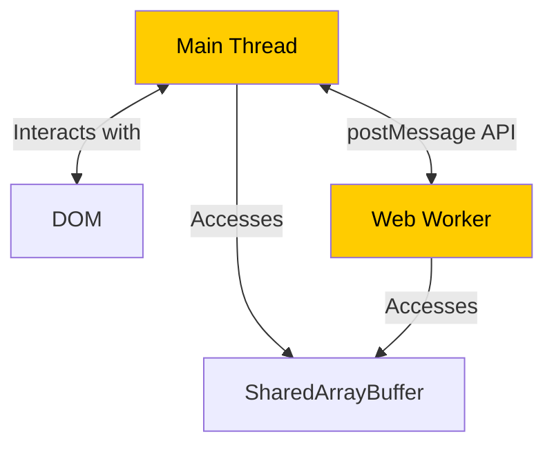
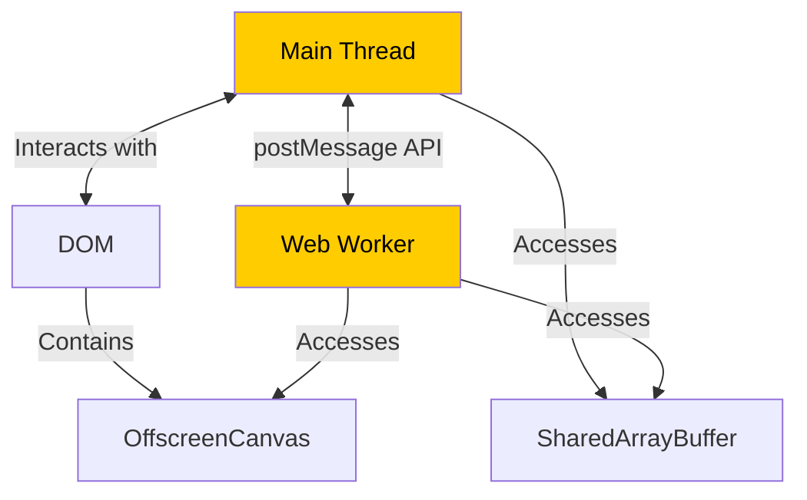
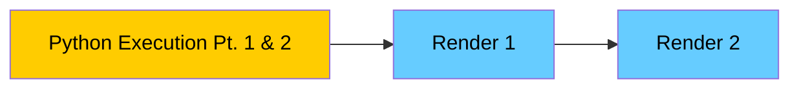
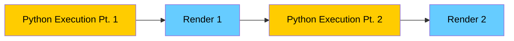
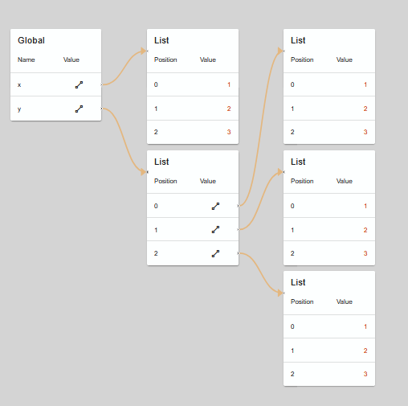

---
# try also 'default' to start simple
theme: dracula
# random image from a curated Unsplash collection by Anthony
# like them? see https://unsplash.com/collections/94734566/slidev
background: https://source.unsplash.com/collection/94734566/1920x1080
# apply any windi css classes to the current slide
class: 'text-center'
# https://sli.dev/custom/highlighters.html
highlighter: shiki
# show line numbers in code blocks
lineNumbers: false
# persist drawings in exports and build
drawings:
  persist: false
# use UnoCSS (experimental)
wakeLock: "build"
# aspect ratio for the slides
aspectRatio: 16/9
css: unocss
---

# WebTigerPython

## Unleashing Python's Full Potential in the Browser

Clemens Bachmann

---
layout: two-cols-header
---

# Who am I

::left::
- Name: Clemens Bachmann
- Occupation: Software Developer / Educator
  - Departement of algorithms and **didactics** at ETH
- clemens.bachmann@inf.ethz.ch
::right::
<div>
  
</div>

---
layout: two-cols-header
---

# TigerJython 2012- (A bit of History)

::left::
- Jython
- Visual Computing
  - Turtle, Games
- Robotics
  - micro:bit
  - Mindstorms EV3
  - etc.
- Works on any Plattform (Windows, Mac, Linux)
- Easy installation
- Interactive Debugger
- Extended Syntax e.g.
  - repeat loop
  - autocasting of inputs

::right::

<br>


---
layout: two-cols-header
---

# TigerJython now

::left::
<v-clicks>
- Jython is still at Python 2.7
- Does not work on all Platforms (iPad / Android)
- No support for popular Python libraries written in C (numpy, scipy, matplotlib, pandas)
- Swing UI looks a bit dated
</v-clicks>

::right::

<br>


---

# WebTigerPython - Bring TigerJython to the Web

- Works really on all Plattforms (Windows, Mac, Linux, Android, iPad)
- No installation needed
- WebAPIs pathe the way for Robotics in the Web
  - WebBluetooth (2017)
  - WebUSB (2021)
- WebAssembly makes it possible to run python in the Browser (Pyodide)
- Critical Requirements
  - Robotics
  - Visual Computing
  - Debugger

> 🛠️ Features marked with this icon are not deployed yet
---

# Robotics

- WebUSB (micro:bit, calliope_mini)
- Simulation 🛠️
- IoT (oxocard) 🛠️

---
layout: iframe-2-cols
url: https://webtigerpython.ethz.ch/?code=NobwRAdghgtgpmAXGGUCWEB0AHAnmAGjABMoAXKJMAMwCcB7GAAhjQGMGAjNMptGbPVq8AVEwA6EOoxacu9Xv0HCmIyZOnMYc-pwV8BQ0ZIDEm2fLIB9bABsArgGcDy4xEmO4ZAMrY4cYgAKAGYABgBKSVo4P3JESSZEpgA3ACUmAF4-WlS0AHMACzJMaKhiK2J8nihbQMiIJJSAGUzsprhqYtLyyrzq2vCkhKS0ambMrNCmKAhiFPSMyfiGxqTqIQB3KFogwYkVxLhbUfHFpgBGadn5iaZQ5dWk2nyiusfhw-Ox5JazqZm5mlbucHo8mLYOmQ3vtGsQjlBcIFzqEImAAL4AXSAA&device=micro%3Abit
---

# Robotics - WebUSB

- Single Devices have to be added for WebUSB
  - Auto-connect on plug if registered
- Only in Chrome
- Safari / Firefox declined to implement the feature
  - Many schools work with iPads
  - No real chrome on iPads

---
layout: iframe-2-cols
url: https://test.webtigerpython.ethz.ch/?code=NobwRAdghgtgpmAXGGUCWEB0AHAnmAGjABMoAXKJMAMwCcB7GAAhjQGMGAjNMptGbPVq8AVEwA6EOoxacu9Xv0HCmIyZOnMYc-pwV8BQ0ZIDEm2fLIB9bABsArgGcDy4xEmO4ZAMrY4cYgAKAEYABlCASklaOD9yREkmJKYANwAlJgBePlo0tABzAAsyTBioYitiAp4oW0CoiGTUgBksnOa4ahKyiqr8mrqI5MTktGoWrOzQpigIYlSMzKmExqbk6iEAdyhaIKGJVaS4WzGJpaZgmbmFyaZQlbXk2gLi-seRo5PxlNbz6dn5ulbsEHo8mLZOmQ3gcmsRjlBcCFwhEwABfAC6QA&device=micro%3Abit
---

# Robotics - Simulation 🛠️

- Works on any device
- No robot needed
- Not real robotics

---
layout: iframe-2-cols
url: https://test.webtigerpython.ethz.ch/?code=NobwRAdghgtgpmAXGGUCWEB0AHAnmAGjABMoAXKJMAMwCcB7GAAnoA96BjKW4ptGbPVpkmAKiYAdCP0HCmqMtgA29MkrQAjHLmWqmUAM5NlZKVIBuUJQFc4RgLxNgAXSkQmjgMwAGMxGpCfHzutFAQAOZwABQQAJSIUkxJTJZKHkyRZACCMBpocBBkADLWrFGxicmptgaYUNjYBcRRqRXuyWT8cAD6ghhkDkzqBmRRoRHRaADUAIyxbcnGSmSY1Gjh1rTRa-EGaABecPZRM94ETACs85VJJjgqo53wvfT9BufVdueotADWcLR7AByehA87qCB2Mi4JRHIEAWjBTA49BUgKBGiBC2Sd06amiQIAIuQoFibksVqwlFANHAlFEgQBZOCGTZweCFAxk9q3ZaYGE0ukMgBCtHWAAsyJCDEYoiUObFuYs7uExc0ACq0WzY3krAzi-gAd3KUjAAF9nEA&device=Oxocard
---

# Robotics - IoT 🛠️

- Connection over IoT
- Works on iPad
- Messages are exchanged
  - Does not work without WebTigerPython
  - Not real robotics
  - Oxocard has no wheels
---

# Robotics Summary

- WebUSB (Chrome only)
- WebBluetooth (Chrome only)
  - We don't support this right now
- No real Chrome on iPads 
  - Chrome on iPad is WebKit (Safari Engine) based
- IoT 🛠️
  - Code runs in Browser
- Simulation works on anything 🛠️

---

# Visual Computing

- Turtle
  - The opposite of a blackbox
  - Intuitive commands (forward, left etc.)
  - Beginner friendly
- Game Frameworks
  - Advanced
  - Popular

---
layout: two-cols-header
---

# WebTigerPython Architecture

::left::

- Python (Pyodide) runs in a Webworker
  - UI does not freeze (single threaded)
- Graphic rendering is done with callbacks
- Pausing execution is done with a SharedArrayBuffer

::right::



---
layout: iframe-2-cols
url: https://webtigerpython.ethz.ch/?code=NobwRAdghgtgpmAXGGUCWEB0AHAnmAGjABMoAXKJMAMwCcB7GAAjIFdayAbOJtGbehyYAqADoRxAY3qdBAClFgARp1ZxFASnHiAxEwCSEJgBU0Aczi0ACrjIALehAK8I2VmSYA3KKrgBnJihaHih3ekkoPzI4YnEjAF4XNzIFMABxNCUmYjQeAEEIAC8oO04mAFFJAGs4IygIRE1tCD0AOXoPYJ8mG3tHcWDsOHImBqZxJkmmakEAdyDiOQBWAAYVpgB6Ua0jKdpzOxSAZgA2da2IDTAAXwBdIA
---

# Turtle / Input Function

- Webworker is Paused
- Interruptbuffer
- SharedBufferArray
- Whole Thread is halted
- Callback functions, cannot access DOM

---
layout: two-cols-header
---

# WebTigerPython Architecture 2

::left::

- Pygame-ce was ported to Pyodide with a canvas backend
- Render Graphics off screen in Web Worker
  - offscreenCanvas
  - Introduced for better interactivity

::right::



---
layout: two-cols-header
---

# Asynchronity Problem

::left::

- Render Updates are done in the Webloop
- It is not possible to synchronously give control to webloop
- asyncio.sleep
  - only in asynchronous contexts
  - async Programming is not easy

::right::

### Synchronous Execution



### Desired Execution Flow



---

# Asynchronity Example

````md magic-move
```py
from pygame import *

def render():
     #...
    display.flip()
def updateActors():
    #...
    render()
def main():
    while True:
        #...
        updateActors()
main()
```
```py
from pygame import *
import asyncio

async def render():
     #...
    display.flip()
    asyncio.sleep(0)

def updateActors():
    #...
    render()
def main():
    while True:
        #...
        updateActors()
main()
```
```py
from pygame import *
import asyncio

async def render():
     #...
    display.flip()
    asyncio.sleep(0)

async def updateActors():
    #...
    await render()
def main():
    while True:
        #...
        updateActors()
main()
```
```py
from pygame import *
import asyncio

async def render():
     #...
    display.flip()
    asyncio.sleep(0)
async def updateActors():
    #...
    await render()
async def main():
    while True:
        #...
        await updateActors()
await main()
```
````

--> Even harder with class methods

---
layout: iframe-2-cols
url: https://webtigerpython.ethz.ch/?code=NobwRAdghgtgpmAXGGUCWEB0AHAnmAGjABMoAXKJMNGbAewCcyACPAc1jgB0IeBiZgEkIaMmigAbNAC84zAAq4O8Hu06YMogBQBKHv2YBlOCwCu2ZmQAWc4mgDO2CVFw97AYwZw4EZgF5WJXU7R2dcTHsTAH0YOmI4LR5mZOYtAGYABgyCZkyMvQgCgXkwuAZWBjpsMrE4ex4vdxYAtXhMACU4Jq1s5l6AVgH8_QgBAFl0Xwk6Kp4Adys0CTkAFQZTOEQklPG6ADc5Jxcy7eSAazhce39A5ThMC_C2aOwve0jiXVPmNAAzZke9mArXuAGkogAZACiADEVgBdRDMb4pZiNMiYAAezAAtAF-t8_gDLkCQZhwe1BABxAASCKRKJS6KxzAA1PjCf9AcCgm1wQBVeSI5G-VFMrqYXC4jmi5JE7lk8EAEQA8gB1ABywsZyWZUvZzAJsuYAiVDCgc2YcAODFw1gwbG-Hi8PkwvyWEi0PRyvXyBVRZOI5rmmHRiWNqOd3ggOS0ACZ-v0fT6dDl0f6UoGHEdwr8pNgvsayWI2gBhabuM66TBiStaABs-TAAF94UA
---

# Asyncify Problem Solution

- We Asyncify code for Students
- Fix Line numbers in Errors
<!--
[click] - JavaScript Promise Integrations (JSPI) 
- Experimental Chrome only feature
```py
import async
from pyodide.ffi import run_sync

def sync_update(url):
  resp = run_sync(asyncio.sleep(0))
```
-->

---
layout: iframe-2-cols
leftWidth: 25%
url: https://webtigerpython.ethz.ch/?code=NobwRAdghgtgpmAXGGUCWEB0AHAnmAGjABMoAXKJMNGbAewCcyACPAc1jgB0If3PMcAB6xsAGzgBnTFDFo4EaagwAKAJRgAvgF0gA
---

# Pygame Aliens

---
layout: iframe-2-cols
url: https://webtigerpython.ethz.ch/?code=NobwRAdghgtgpmAXGGUCWEB0AHAnmAGjABMoAXKJMAMwCcB7GAAjIFdayAbOJtGbehyYAqADoRx1NJ04Bjep0EAKUSigBzOBAqqAlOOxb5i2irWbtUPeIBGcdRgD6UmUv0RacQ-SYBWROJMQUzUxEoAjABsAAzuwUwcEQAsSe5axM7SnG5gAL4AukA
---

# Debugger

- Toggled in Settings
- Turtle Step by Step
- Breakpoints can be toggled during execution

---
layout: iframe-2-cols
url: https://webtigerpython.ethz.ch/?code=NobwRAdghgtgpmAXGGUCWEB0AHAnmAGjABMoAXKJMAHQmLgDMACBtAIwAoIBKRWpgUzTMITADwBeJgAY-owQoBOcMgFdFo6U36C4AG2FNREqQEY5CpSvWjT2-QP0BnOBcsDlajS3ZcmAWiZTbiYAah9OUUCAJhDaWmMmABZaZSdVPTImKVZI7lpsRQwyDjSMsm4wAF8AXS
---

# Debugger Recursion

- Every scope is displayed

---
layout: iframe-2-cols
url: https://webtigerpython.ethz.ch/?code=NobwRAdghgtgpmAXGGUCWEB0AHAnmAGjABMoAXKJMAYwBsoBnBgAgAU4AnBgewkQB0IzZsTgAzZgH1JGNGWkAKBnFpiCzaPHVQA5nACUAocObLVmTXGYBeDbDiCTplWMy6rt94MHYAjDbZOHggFfjAAKW4ACwgw9QBmADZ9bwhsDgwyBT8LexS0jIgsnPd9ZjAAXwBdIA
---

# Debugger Classes

---
layout: two-cols-header
---

# Debugger Overview

::left::
Dictionaries

Self Referencing Lists


::right::
Nested Lists


---

# Conclusion

- Most things do work in the browser
- Except for iPads, all Features to Work on any device
  - Not on any browser (Firefox/Safari)
- Try it out at [wtp.ethz.ch](https://webtigerpython.ethz.ch)
- Coding exercises [python-online.ch](https://python-online.ch)

# Outlook

- Educational Database library
- Bluetooth Robotics
- Multifile
- Open Source